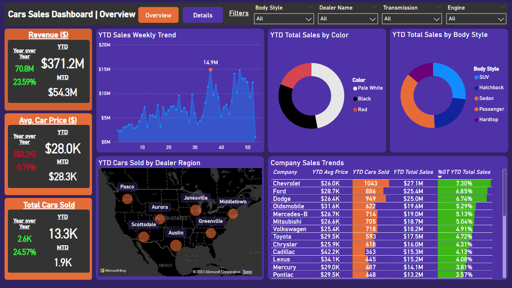

# Power BI Sales Analysis Dashboard

**Tools:** Power BI

## Overview

This repository contains the **Power BI Car Sales Analysis Dashboard**. The dashboard is designed to provide a comprehensive overview of a company's sales performance, with various metrics and interactive visuals that allow users to explore the data in detail.

### Goal

The main goal of this dashboard is to help businesses analyze their sales data effectively. It is a powerful tool for identifying trends, tracking performance, and understanding key factors influencing sales outcomes. By visualizing sales data in an interactive format, users can make informed decisions based on real-time insights.

### Dashboard Key Features
1. Sales Performance Overview
2. Year-over-Year Comparisons
3. Interactive Filters



## How to Use the Dashboard

1. **Clone the Repository**:
    ```bash
    git clone https://github.com/your-username/sales-analysis-dashboard.git
    ```
   
2. **Open in Power BI Desktop**:
   - Download and install [Power BI Desktop](https://powerbi.microsoft.com/desktop/).
   - Open the `.pbix` file in Power BI Desktop.

3. **Explore the Data**:
   - Use the interactive filters on the dashboard to explore different aspects of the car sales data.
   - Hover over data points to see detailed information and tooltips.
   - Drill down into specific visuals to gain deeper insights.

## Steps

1. **Imported Data**:
   - Imported the provided `.xlsx` file into Power BI.

2. **Data Cleaning**:
   - Replaced the typo *"Double Overhead Camshaft"* with *"Double Overhead Camshaft."*
   - Ensured the data is 100% valid, with no errors or empty fields.

3. **Create a Calendar/Date Table**:
   - Created the calendar table using the following formula:
     ```DAX
     Calendar Table = CALENDAR(MIN(car_data[Date]), MAX(car_data[Date]))
     ```
   - Extracted the following columns for better dashboard usability:
     ```DAX
     Year = YEAR('Calendar Table'[Date])
     Month = FORMAT('Calendar Table'[Date],"MMMM")
     Week = WEEKNUM('Calendar Table'[Date])
     ```

4. **Manage Relationships**:
   - Connected the `Calendar Table[Date]` (Primary Key) to `car_data[Date]` (Foreign Key) with a 1-to-many (1:*) relationship in Model view.

5. **Measures Used**:
   - Used the following measures:
     ```DAX
     Avg Price = SUM(car_data[Price ($)])/COUNT(car_data[Car_id])
     YTD Avg Price = TOTALYTD([Avg Price],'Calendar Table'[Date])
     PYTD Avg Price = CALCULATE([Avg Price],SAMEPERIODLASTYEAR('Calendar Table'[Date].[Date]))
     MTD Avg Price = TOTALMTD([Avg Price],'Calendar Table'[Date])
     YoY Avg Price = [Average Price Difference]/[PYTD Avg Price]
     Average Price Difference = [YTD Avg Price]-[PYTD Avg Price]
     Average Price Difference Color = IF([Average Price Difference]>0,"Green","Red")

     YTD Cars Sold = TOTALYTD(COUNT(car_data[Car_id]),'Calendar Table'[Date])
     PYTD Cars Sold = CALCULATE(COUNT(car_data[Car_id]),SAMEPERIODLASTYEAR('Calendar Table'[Date].[Date]))
     MTD Cars Sold = TOTALMTD(COUNT(car_data[Car_id]),'Calendar Table'[Date])
     YoY Cars Sold Growth = [Cars Sold Difference]/[PYTD Cars Sold]
     Cars Sold Difference = [YTD Cars Sold]-[PYTD Cars Sold]
     Cars Sold Color = IF([Cars Sold Difference]>0,"Green","Red")

     YTD Total Sales = TOTALYTD(SUM(car_data[Price ($)]),'Calendar Table'[Date])
     PYTD Total Sales = CALCULATE(SUM(car_data[Price ($)]),SAMEPERIODLASTYEAR('Calendar Table'[Date]))
     MTD Sales = TOTALMTD(SUM(car_data[Price ($)]),'Calendar Table'[Date])
     YoY Sales Growth = [Sales Difference]/[PYTD Total Sales]
     Sales Difference = [YTD Total Sales]-[PYTD Total Sales]
     Sales Diff Color = IF([Sales Difference]>0,"Green","Red")
     Total Sales = SUM(car_data[Price ($)])
     Max YTD Sales Weekly Trend = IF(MAXX(ALLSELECTED('Calendar Table'[Week]),[Total Sales])=[Total Sales],MAXX(ALLSELECTED('Calendar Table'[Week]),[Total Sales]),BLANK())

     Max Point = IF(MAXX(ALLSELECTED('Calendar Table'[Week]),[Total Sales])=[Total Sales],MAXX(ALLSELECTED('Calendar Table'[Week]),[Total Sales]), BLANK())
     ```

6. **Creating the Dashboard**:
   - Created all dashboard visuals using the measures above.

## Credits

Credits to [Data Tutorials](https://www.youtube.com/@datatutorials1) for providing the Excel data and inspiration via their tutorial.

## Contact

For any questions or support, please reach out via [LinkedIn](https://www.linkedin.com/in/dimitris-danos).
